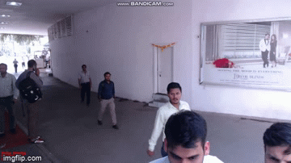

# Rapiid

A real time automated script which will fetch video data from GCP bucket, change the fps to orignal if not and run several YOLO & Caffe models on it. The models used in this sript are age classifier, gender classifer, Object Tracker and Front Face detector. The script will run at a fixed time daily and collect data points such as unique male count, unique female count, total men count, total female count and the counts for each age group per minute. The script will then convert the hourly collected data to a daily collected data and that to a completely collated data for visualization. The object tracker being used is a dlib tracker along with a custom algorithm to stop and continue tracking depending on time for which subject isn't present in the frames. The script will store the collected datapoints on a GCP server.

